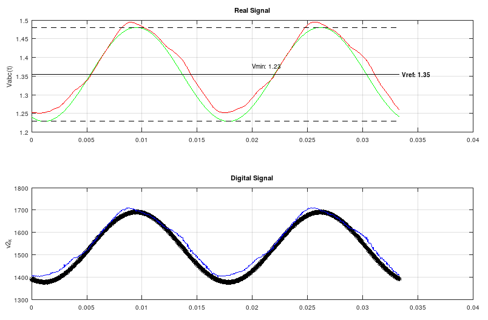

# ESP32 - ADC Peripheral 
## nonlinear curve with attenuattion dB11
This ADC peripheral has a nonlinearity on the full 2^n_bit domain. With some experimental setup was possible to found a range from 120 mV corresponding to 1 in decimal value to 2.55 V corresponding to 3020. On this range the peripheral achieved a linear ADC curve.

Simulation using adc_esp32.m with 380 W load. Real data ploted on simulated signal.
